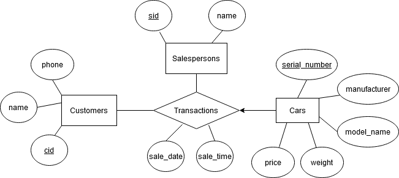

# Section 2
There are 4 files included for this section.

## `section2.sql`
Contains SQL statements to create 4 tables: `Customers`, `Salespersons`, `Cars` and `Transactions` (refer to ER diagram below). There are statements to load dummy data into the tables for testing the database.

At the end is a statement to create the procedure `new_transaction`. This is a routine for entering information about new sales transactions into the database.

## `section2_er_diagram.png`
An entity-relationship diagram showing the database design.

## `dockerfile`
Uses the base PostgreSQL image to set up a database. Makes a copy of `section2.sql` and runs it to initialize the database named `dealership`.
Username is `postgres`
and password is `docker`.

## `section2_queries.sql`
Contains 2 SQL statements to query the database. The first statement finds the list of customers and their spending. The second statement finds the top 3 car manufacturers and the quantity sold for the current month.
